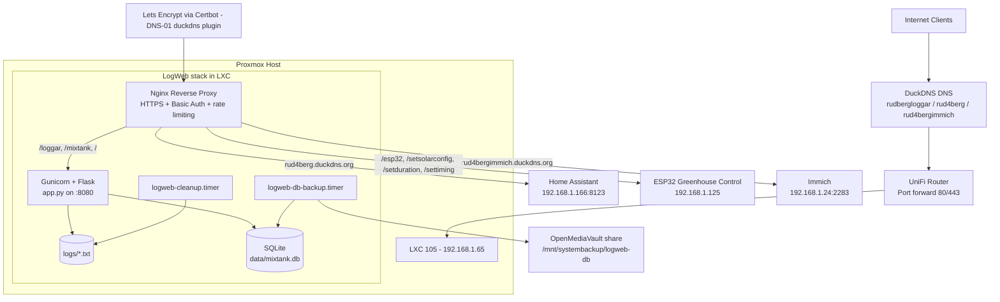
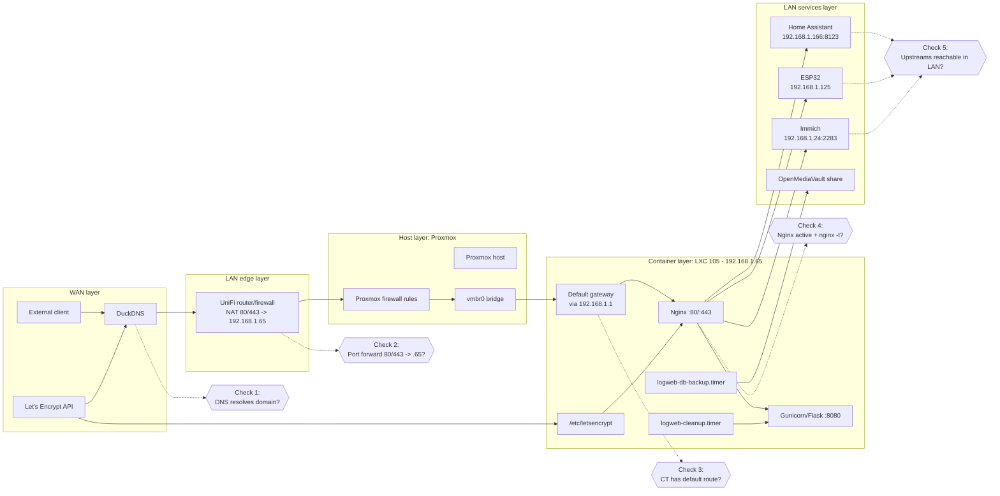

# ProxmoxPubliseradeWebbLoggar

Ett Python/Flask-projekt som publicerar textloggar (`.txt`) via webbläsare.

## Funktioner

- Listar `.txt`-filer grupperade i kategorier: `VMM1`, `VMM2`, `MixTank`, `Irrigation`
- Visar endast loggfiler fran de senaste 5 dagarna per kategori
- Raderar automatiskt `.txt`-filer som ar aldre an 5 dagar per kategori
- Visar varje loggfil som ren text via `/logs/<kategori>/<filnamn>`
- **Registrera och visa MixTank-mätningar**: datum, PH, temperatur, EC, tillsatt PH-, gödning
- **Radera felaktig MixTank-mätning** direkt i tabellen
- **Grafisk trendvisning 30 dagar** för PH, temperatur och EC
- **CSV-export av MixTank-data**: allt, senaste 7 dagar, senaste 30 dagar
- Startsida med portal för alla tjänster
- Fungerar bakom Nginx reverse proxy med HTTPS

## Lokal körning

1. Skapa virtuell miljö:
   - `python -m venv .venv`
2. Aktivera miljön:
   - PowerShell: `.\.venv\Scripts\Activate.ps1`
3. Installera beroenden:
   - `pip install -r requirements.txt`
4. Starta appen:
   - `python app.py`
5. Öppna:
   - `http://localhost:8080`

Lagg ut loggfiler som `.txt` i respektive kategori:

- `logs/VMM1/` - VMM1-loggar
- `logs/VMM2/` - VMM2-loggar
- `logs/MixTank/` - MixTank-loggfiler
- `logs/Irrigation/` - Bevattnint-loggar

## MixTank-matningar

Registrera och visa uppmatta varden fran MixTanken pa `https://rudbergloggar.duckdns.org/mixtank`:

- **Datum**: När mätningen gjordes
- **PH**: Värdets pH-nivå
- **Temp**: Temperaturen i °C
- **EC**: Elektrisk ledningsförmåga
- **Tillsatt ml PH-**: Mängd tillsatt pH-minus
- **Tillsatt konc gödning ml**: Mängd tillsatt gödning
- **Radera mätning**: ta bort felregistrerade poster via knappen `Radera`
- **Graf 30 dagar**: linjegraf med PH, temperatur och EC
- **CSV-export**: knappar för allt, 7 dagar och 30 dagar

Datan lagras i en SQLite-databas i `data/mixtank.db` och visas i en tabell sorterad från senast mätning först.

Tips for produktion:

- Undvik att radera databasfilen vid felsokning.
- Satt eventuell extern datavolym med miljo-variabeln `LOGWEB_DATA_DIR`.

Portalen pa `https://rudbergloggar.duckdns.org/` visar en knapp for MixTank-matningar.

## Produktion (nuvarande upplägg)

- Proxmox loggserver: `192.168.1.65`
- ESP32 Greenhouse Control: `192.168.1.125`
- Home Assistant: `192.168.1.166`
- Loggdomän: `rudbergloggar.duckdns.org`
- HA-domän: `rud4berg.duckdns.org`
- Immich-domän: `rud4bergimmich.duckdns.org`
- Publik port forward i UniFi:
  - TCP 80 -> `192.168.1.65:80`
  - TCP 443 -> `192.168.1.65:443`

## System architecture diagram

For a compact and render-safe diagram, see [system-architecture.md](system-architecture.md).



## System architecture diagram (network-centric for driftfelsokning)



### Felsokningsordning per lager (WAN -> LAN -> Host -> Container)

1. WAN (DNS + extern vag in)
   - Kontrollera att domanen pekar ratt och svarar externt.
   - Exempel:
     - nslookup rudbergloggar.duckdns.org
     - curl -I https://rudbergloggar.duckdns.org --max-time 10

2. LAN edge (router/NAT)
   - Verifiera port forward 80/443 till 192.168.1.65.
   - Bekrafta att ingen regel blockerar inkommande trafik pa 80/443.

3. Host (Proxmox)
   - Kontrollera bridge och host-route.
   - Exempel:
     - ip a
     - ip r
     - pct config 105

4. Container (LXC 105)
   - Kontrollera default gateway, DNS och egress 443.
   - Exempel:
     - pct exec 105 -- ip r
     - pct exec 105 -- cat /etc/resolv.conf
     - pct exec 105 -- curl -I https://github.com --max-time 10

5. App ingress i container
   - Verifiera Nginx och backend lokalt.
   - Exempel:
     - pct exec 105 -- nginx -t
     - pct exec 105 -- systemctl status nginx --no-pager -l
     - pct exec 105 -- systemctl status logweb --no-pager -l
     - pct exec 105 -- curl -I http://127.0.0.1:8080

6. Upstreams pa LAN (fran Nginx)
   - Bekrafta att proxymal ar nåbara.
   - Exempel:
     - pct exec 105 -- curl -kI https://192.168.1.166:8123 --max-time 10
     - pct exec 105 -- curl -I http://192.168.1.24:2283 --max-time 10
     - pct exec 105 -- curl -I http://192.168.1.125 --max-time 10

7. SSL och certifikat
   - Verifiera certifikatfiler och validera reload.
   - Exempel:
     - pct exec 105 -- certbot certificates
     - pct exec 105 -- nginx -t
     - pct exec 105 -- systemctl reload nginx

8. Vanliga felbilder och snabbfix
   - Saknad default route i LXC: lagg till gateway i CT-konfig och starta om CT.
   - Nginx-fel efter deploy: kontrollera /etc/nginx/sites-available/reverse-proxy med nginx -t.
   - GitHub ej nåbar från LXC: kontrollera default route forst, sedan DNS.

## Deployment i Proxmox LXC (Debian/Ubuntu)

1. Installera paket:
   - `apt update`
   - `apt install -y python3 python3-venv python3-pip git nginx`
2. Klona repo:
   - `git clone <DIN_GITHUB_REPO_URL> /opt/logweb`
   - `cd /opt/logweb`
3. Skapa virtuell miljö och installera beroenden:
   - `python3 -m venv .venv`
   - `source .venv/bin/activate`
   - `pip install -r requirements.txt`

### Systemd service

Skapa `/etc/systemd/system/logweb.service`:

```ini
[Unit]
Description=Loggwebb Flask Service
After=network.target

[Service]
Type=simple
User=www-data
Group=www-data
WorkingDirectory=/opt/logweb
Environment="PATH=/opt/logweb/.venv/bin"
ExecStart=/opt/logweb/.venv/bin/gunicorn -b 127.0.0.1:8080 app:app
Restart=always
RestartSec=3

[Install]
WantedBy=multi-user.target
```

Aktivera:

- `systemctl daemon-reload`
- `systemctl enable --now logweb`
- `systemctl status logweb`

### Daglig städning (systemd timer)

Aktivera timer som raderar `.txt`-filer aldre an 5 dagar en gang per dygn.

- `cp /opt/logweb/deploy/logweb-cleanup.service /etc/systemd/system/logweb-cleanup.service`
- `cp /opt/logweb/deploy/logweb-cleanup.timer /etc/systemd/system/logweb-cleanup.timer`
- `systemctl daemon-reload`
- `systemctl enable --now logweb-cleanup.timer`
- `systemctl status logweb-cleanup.timer --no-pager`
- `systemctl list-timers --all | grep logweb-cleanup`

Manuell testkorning av städning:

- `systemctl start logweb-cleanup.service`
- `journalctl -u logweb-cleanup.service -n 50 --no-pager`

Fallback utan systemd timer (cron):

- `crontab -e`
- `15 3 * * * /opt/logweb/.venv/bin/python -c "from app import cleanup_old_logs; cleanup_old_logs()" >> /var/log/logweb-cleanup.log 2>&1`
- `crontab -l | grep cleanup_old_logs`

### Nattlig backup av MixTank-databas (till OPENMEDIAVAULT)

Mål: skapa datumstampade backuper av `data/mixtank.db` varje natt till `\\OPENMEDIAVAULT\Hela_Disken2\systembackup`.

1. Installera CIFS-stod:
   - `apt install -y cifs-utils`
2. Skapa mountpunkt:
   - `mkdir -p /mnt/systembackup`
3. Skapa credential-fil:
   - `mkdir -p /etc/smbcredentials`
   - `cat > /etc/smbcredentials/omv-systembackup <<'EOF'`
   - `username=DITT_OMV_USER`
   - `password=DITT_OMV_LOSENORD`
   - `EOF`
   - `chmod 600 /etc/smbcredentials/omv-systembackup`
4. Lagga till i `/etc/fstab` (monterar undermappen `systembackup`):
   - `//OPENMEDIAVAULT/Hela_Disken2 /mnt/systembackup cifs credentials=/etc/smbcredentials/omv-systembackup,uid=0,gid=0,file_mode=0640,dir_mode=0750,vers=3.0,prefixpath=systembackup,nofail,_netdev,x-systemd.automount 0 0`
5. Montera och verifiera:
   - `mount -a`
   - `ls -la /mnt/systembackup`

Installera backup-timer:

1. Gor script korbart:
   - `chmod +x /opt/logweb/deploy/backup-mixtank-db.sh`
2. Kopiera systemd-filer:
   - `cp /opt/logweb/deploy/logweb-db-backup.service /etc/systemd/system/logweb-db-backup.service`
   - `cp /opt/logweb/deploy/logweb-db-backup.timer /etc/systemd/system/logweb-db-backup.timer`
3. (Valfritt) konfigurera destination/retention i `/etc/default/logweb-db-backup`:

```bash
cat > /etc/default/logweb-db-backup <<'EOF'
LOGWEB_DB_PATH=/opt/logweb/data/mixtank.db
LOGWEB_DB_BACKUP_DIR=/mnt/systembackup/logweb-db
LOGWEB_DB_BACKUP_KEEP_DAYS=30
EOF
```

4. Aktivera timern:
   - `systemctl daemon-reload`
   - `systemctl enable --now logweb-db-backup.timer`
   - `systemctl list-timers --all | grep logweb-db-backup`
5. Testkor backup direkt:
   - `systemctl start logweb-db-backup.service`
   - `journalctl -u logweb-db-backup.service -n 50 --no-pager`
   - `ls -la /mnt/systembackup/logweb-db`

Backupscriptet verifierar varje backup innan den behalls:

- Kontrollerar att backupfilen inte ar tom
- Kor SQLite `PRAGMA integrity_check` pa backupkopian
- Skapar checksum-fil (`.sha256`) bredvid varje `.db`
- Loggar filstorlek och verifieringsstatus i systemd-journalen

### Nginx (dual-domain reverse proxy)

Loggdomanen ar skyddad med HTTP Basic Auth i [deploy/nginx-logweb.conf](deploy/nginx-logweb.conf).

Undantag for ESP32:

- `https://rudbergloggar.duckdns.org/esp32/` -> interaktiv ESP32-UI bakom Basic Auth
- `https://rudbergloggar.duckdns.org/setsolarconfig`
- `https://rudbergloggar.duckdns.org/setduration`
- `https://rudbergloggar.duckdns.org/settiming`

De tre konfig-endpointerna ovan proxas direkt till `192.168.1.125` utan Basic Auth, men ar begransade till `GET` och `POST` samt enkel rate limiting i Nginx. Nuvarande limit ar dimensionerad for hogst cirka ett legitimt anrop per minut, med liten marginal for retry.

Efter inloggning pa `https://rudbergloggar.duckdns.org/` visas en portal med tva val:

- `https://rudbergloggar.duckdns.org/loggar` -> Proxmox loggserver (Flask)
- `https://rudbergloggar.duckdns.org/esp32/` -> ESP32 Greenhouse Control (192.168.1.125 via Nginx proxy)

Skapa fil for behoriga anvandare (forsta anvandaren):

- `apt install -y apache2-utils`
- `htpasswd -c /etc/nginx/.htpasswd-logweb loggadmin`

Lagg till fler behoriga anvandare:

- `htpasswd /etc/nginx/.htpasswd-logweb anna`

Kopiera projektets konfig:

- `cp /opt/logweb/deploy/nginx-logweb.conf /etc/nginx/sites-available/reverse-proxy`
- `rm -f /etc/nginx/sites-enabled/default`
- `ln -sfn /etc/nginx/sites-available/reverse-proxy /etc/nginx/sites-enabled/reverse-proxy`
- `nginx -t`
- `systemctl enable --now nginx`
- `systemctl reload nginx`

Viktigt for portalen:

- Startsidan `https://rudbergloggar.duckdns.org/` visar portalen i `app.py`
- Loggsidan ligger pa `https://rudbergloggar.duckdns.org/loggar`
- Om du ser loggsidan direkt pa `/`, kora uppdateringen pa servern sa att senaste commit ar laddad:
   - `sudo /opt/logweb/deploy/update-logweb.sh`
   - eller `git -C /opt/logweb rev-parse --short HEAD` och jamfor med senaste commit

### Enkel uppdatering från GitHub (ett kommando)

Projektet innehaller ett uppdateringsskript i `deploy/update-logweb.sh`.

1. Forsta gangen, gor skriptet korbart:
   - `chmod +x /opt/logweb/deploy/update-logweb.sh`
2. Kor uppdatering:
   - `sudo /opt/logweb/deploy/update-logweb.sh`

Skriptet gor detta automatiskt:

- Hamtar senaste kod fran `origin/main` (fast-forward only)
- Installerar/uppdaterar Python-beroenden
- Installerar projektets Nginx-config till `/etc/nginx/sites-available/reverse-proxy`
- Startar om `logweb`
- Validerar och laddar om Nginx
- Gor en lokal health-check med retry (upp till 20 sekunder)

Om du vill uppdatera en annan branch:

- `sudo /opt/logweb/deploy/update-logweb.sh <branchnamn>`

## HTTPS med Let's Encrypt + DuckDNS (DNS-01)

Använd DNS-challenge om HTTP-challenge störs av redirect/annan ingress.

1. Installera plugin:
   - `apt install -y python3-certbot-dns-duckdns`
2. Skapa credentials-fil (OBS: håll token hemligt):

```bash
mkdir -p /etc/letsencrypt/duckdns
cat > /etc/letsencrypt/duckdns/credentials.ini <<'EOF'
dns_duckdns_token = DITT_DUCKDNS_TOKEN
EOF
chmod 600 /etc/letsencrypt/duckdns/credentials.ini
```

3. Hämta certifikat:

```bash
certbot certonly \
  --authenticator dns-duckdns \
  --dns-duckdns-credentials /etc/letsencrypt/duckdns/credentials.ini \
  --dns-duckdns-propagation-seconds 60 \
  -d rud4berg.duckdns.org \
  -d rudbergloggar.duckdns.org \
   -d rud4bergimmich.duckdns.org \
  -m dinmail@exempel.se \
  --agree-tos --no-eff-email --non-interactive
```

4. Ladda om Nginx:
   - `nginx -t && systemctl reload nginx`

### Enkel certifikat-uppdatering (ett kommando)

Projektet innehaller ett certifikat-skript i `deploy/update-certificates.sh`.

1. Forsta gangen, gor skriptet korbart:
   - `chmod +x /opt/logweb/deploy/update-certificates.sh`
2. Kor certifikat-uppdatering for alla tre domaner:
   - `sudo /opt/logweb/deploy/update-certificates.sh dinmail@exempel.se`

Skriptet gor detta automatiskt:

- Uppdaterar/hamtar certifikat `rud4berg.duckdns.org` med domanerna `rud4berg.duckdns.org` och `rud4bergimmich.duckdns.org`
- Uppdaterar/hamtar separat certifikat `rudbergloggar.duckdns.org` for loggdomanen
- Visar installerade certifikat
- Validerar Nginx-konfig och laddar om Nginx

Viktigt om certifikat-sokvagar i Nginx:

- Nar certifikatet for `rud4berg.duckdns.org` expanderas med Immich-domänen behalls cert-namnet `rud4berg.duckdns.org`
- Da ligger filerna under `/etc/letsencrypt/live/rud4berg.duckdns.org/` for bade `rud4berg.duckdns.org` och `rud4bergimmich.duckdns.org`
- Peka `ssl_certificate` och `ssl_certificate_key` till den katalogen for alla domaner som ingar i samma certifikat

Verifiera domanlistan i certifikatet:

- `certbot certificates`
- Kontrollera att cert-namnet `rud4berg.duckdns.org` visar `Domains: rud4berg.duckdns.org rud4bergimmich.duckdns.org`

### Uppdatera befintligt certifikat med ny domän

Om certifikatet redan finns men saknar Immich-domänen, kör samma `certbot certonly`-kommando som ovan med alla tre `-d`-värden. Certbot uppdaterar då certifikatet så att det även innehåller:

- `rud4bergimmich.duckdns.org`

Kontrollera resultatet:

- `certbot certificates`
- `nginx -t && systemctl reload nginx`

Testa automatisk förnyelse:

- `certbot renew --dry-run`

## Immich HTTPS-konfiguration bakom reverse proxy

Immich behöver känna till sitt PUBLIC_URL för att generera rätta HTTPS-URL:er bakom reverse proxy.

**Om Immich kör i Docker (docker-compose.yml):**

```yaml
services:
  immich-server:
    environment:
      - PUBLIC_URL=https://rud4bergimmich.duckdns.org
      # Övriga Immich-inställningar...
```

**Om Immich kör i systemd service:**

1. Redigera servicefilen:
   - `nano /etc/systemd/system/immich.service`
2. Lägg till miljövariabel i `[Service]`-sektionen:
   ```ini
   Environment="PUBLIC_URL=https://rud4bergimmich.duckdns.org"
   ```
3. Ladda om och starta om:
   - `systemctl daemon-reload`
   - `systemctl restart immich`

**Verifiera konfiguration:**

1. Öppna https://rud4bergimmich.duckdns.org i browser
2. Kontrollera att API-URL:er i DevTools (F12 → Network) visar `https://` och inte `http://`
3. Testa uppladdning av foto/video för att bekräfta proxy-headers fungerar

## Delad loggmapp mellan Node-RED och loggserver (unprivileged LXC)

Mål: Node-RED skriver i delad mapp och loggwebben publicerar samma filer.

### 1) På Proxmox host

```bash
# Exempel-CTID, byt vid behov
CT_NODE=101
CT_LOG=102

mkdir -p /srv/shared/nodered-logs

# Standard unprivileged mapping: container 1500 -> host 101500
chown 101500:101500 /srv/shared/nodered-logs
chmod 2770 /srv/shared/nodered-logs

pct set $CT_NODE -mp0 /srv/shared/nodered-logs,mp=/opt/nodered-logs
pct set $CT_LOG  -mp0 /srv/shared/nodered-logs,mp=/opt/logweb/logs

pct stop $CT_NODE; pct start $CT_NODE
pct stop $CT_LOG;  pct start $CT_LOG
```

### 2) I Node-RED-container

```bash
groupadd -g 1500 sharedlogs || true
usermod -aG sharedlogs nodered
echo "test $(date)" > /opt/nodered-logs/test.txt
```

### 3) I loggserver-container

```bash
groupadd -g 1500 sharedlogs || true
usermod -aG sharedlogs www-data
cat /opt/logweb/logs/test.txt
```

## Node-RED skrivmönster (exempel)

Skriv till:

- `/opt/nodered-logs/VMM1/log-YYYY-MM-DD.txt`
- `/opt/nodered-logs/VMM2/log-YYYY-MM-DD.txt`
- `/opt/nodered-logs/MixTank/log-YYYY-MM-DD.txt`
- `/opt/nodered-logs/Irrigation/log-YYYY-MM-DD.txt`

och appenda en rad i taget, t.ex.:

- `2026-05-17 12:00:00 INFO heartbeat ok`

## GitHub snabbstart

1. Initiera git lokalt:
   - `git init`
   - `git add .`
   - `git commit -m "Initial commit: log web server for Proxmox LXC"`
2. Koppla remote:
   - `git remote add origin <DIN_GITHUB_REPO_URL>`
3. Pusha:
   - `git branch -M main`
   - `git push -u origin main`
