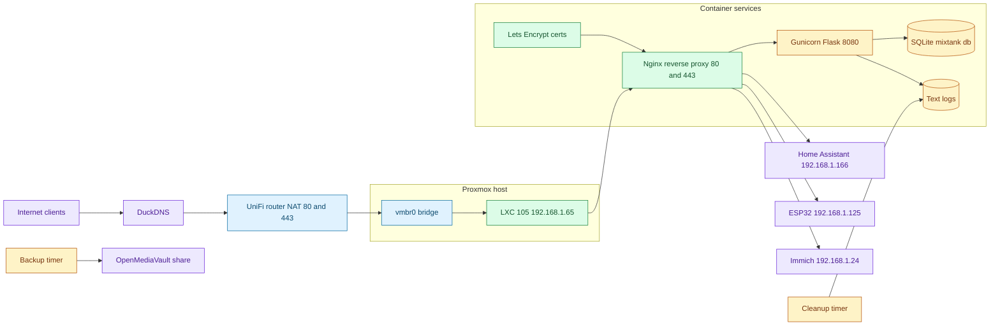

# System Architecture

A compact network-centric diagram for operations and troubleshooting.

```mermaid
flowchart LR
    classDef edge fill:#e0f2fe,stroke:#0369a1,stroke-width:1px,color:#0c4a6e
    classDef core fill:#dcfce7,stroke:#15803d,stroke-width:1px,color:#14532d
    classDef app fill:#fef3c7,stroke:#b45309,stroke-width:1px,color:#78350f
    classDef ext fill:#ede9fe,stroke:#6d28d9,stroke-width:1px,color:#4c1d95

    Internet[Internet clients]:::ext --> DNS[DuckDNS]:::ext
    DNS --> Router[UniFi router NAT 80 and 443]:::edge

    subgraph ProxmoxHost[Proxmox host]
        Bridge[vmbr0 bridge]:::edge
        CT[LXC 105 192.168.1.65]:::core
        Bridge --> CT
    end

    Router --> Bridge

    subgraph LXCStack[Container services]
        Nginx[Nginx reverse proxy 80 and 443]:::core
        Flask[Gunicorn Flask 8080]:::app
        DB[(SQLite mixtank db)]:::app
        Logs[(Text logs)]:::app
        Certs[Lets Encrypt certs]:::core
        Nginx --> Flask
        Flask --> DB
        Flask --> Logs
        Certs --> Nginx
    end

    CT --> Nginx

    Nginx --> HA[Home Assistant 192.168.1.166]:::ext
    Nginx --> ESP32[ESP32 192.168.1.125]:::ext
    Nginx --> Immich[Immich 192.168.1.24]:::ext

    Backup[Backup timer]:::app --> OMV[OpenMediaVault share]:::ext
    Cleanup[Cleanup timer]:::app --> Logs
```